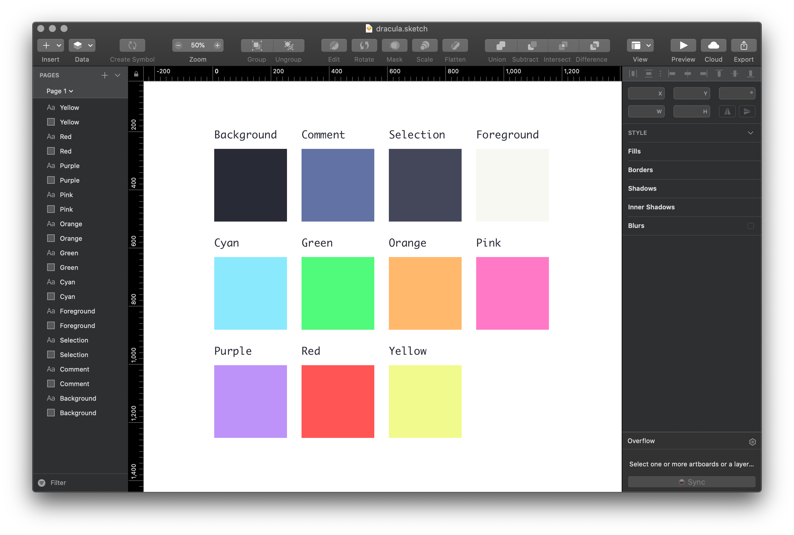

# Dracula for [Sketch](https://www.sketch.com)

> A dark theme for [Sketch](https://www.sketch.com).

## Install

All instructions can be found at [draculatheme.com/sketch](https://draculatheme.com/sketch).

## Team

This theme is maintained by the following person(s) and a bunch of [awesome contributors](https://github.com/dracula/sketch/graphs/contributors).

 |
--- |
[Zeno Rocha](https://github.com/zenorocha) |

## License

[MIT License](./LICENSE)